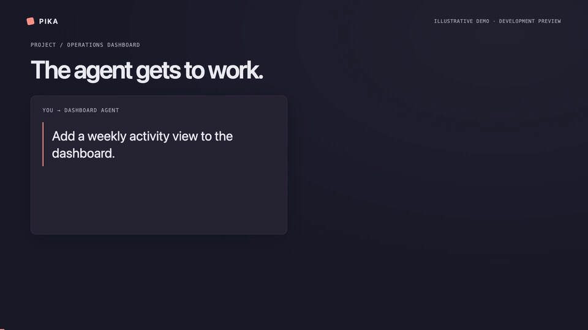

# Pika

**A terminal home for your coding agents—and a way for them to consult each other.**

Pika connects your existing **Codex, Claude Code and OpenCode** conversations.
Your agents can find relevant experience from earlier work and ask focused
questions in a separate consultation. You get one board to see who needs you,
check results and return to a conversation.

[](media/demo/pika.mp4)

[Watch the 60-second video](media/demo/pika.mp4) · Illustrative demo

## Borrow the experience. Keep the work moving.

An agent adding CSV downloads to a support inbox needs export rules. A reporting
project already worked them out. Through Pika, the support agent finds that
project's expert card, consults its existing context and checks the referenced
file. Meanwhile, the original reporting agent keeps working on its own task.
The consultation's questions and answers do not enter its main conversation.

- **Find expertise.** Expert cards summarize a conversation's scope, topics and
  relevant artifacts. Your agent searches these cards, not every old transcript.
- **Consult without interrupting.** The included `agent-convo` skill lets your
  agent open a separate side consultation when prior work would help.
- **See what needs you.** The live board distinguishes working agents, results
  and requests for your input. Peek at a result or stop watching without deleting
  the conversation's history.
- **Return by name.** Run `pika NAME`, or select a conversation on the board, to
  reopen it in its native agent interface. Pika manages the tmux home and checks
  the conversation's identity before attaching.
- **Connect your machines.** Discover and select trusted SSH/Tailscale machines
  during setup. Monitor and consult across them with Pika installed on each.
  One laptop is enough to start.

## Install

Requires **macOS or Linux**, **tmux**, and at least one supported agent CLI,
already installed and signed in. Pika's installer handles its own Python runtime
and gives platform-specific instructions if tmux is missing.

```bash
curl -fsSL https://github.com/ayushjainr/pikamux/releases/download/v0.5.0a3/install.sh | bash -s -- --version v0.5.0a3
```

You can [read the installer](https://github.com/ayushjainr/pikamux/releases/download/v0.5.0a3/install.sh)
before running it. Pika installs to your user account and asks before changing
shell or agent settings. Existing configuration is backed up.

**Current release: v0.5.0a3 (alpha).** Consultations with some newer Codex
conversations require the source-preview version; see
[compatibility and setup](docs/first-consultation.md#release-compatibility).
Native Windows agent hosting is not supported; the optional Windows client
bridge is experimental. See [platform support](docs/guide.md#install-a-pika-node).

## Start with one conversation

1. **Approve setup.** The installer offers onboarding; run `pika setup` if you
   skipped it. Review the proposed integrations and included `agent-convo` skill,
   then choose an existing conversation. In Codex, review and trust hooks through
   `/hooks`.
2. **Make it discoverable.** Follow the [first-consultation guide](docs/first-consultation.md)
   to publish or generate its expert card. Skip this if it already has a useful
   card. Setup does not create missing cards or interview agents automatically.
3. **Give your current agent a task**, and tell it:

   > Use agent-convo when relevant prior work would help. Look for an expert,
   > consult it if needed, check the evidence and continue the task.

Your agent handles discovery and consultation; you do not need to choose the
expert or relay its answer. Creating a card by interview and consulting an
expert use provider quota. Card searches and ordinary board views do not.

## Everyday use

```bash
pika                 # Open the live board
pika support-inbox   # Open a conversation by name
pika setup           # Review integrations, conversations and machines
pika update          # Check for and install an update with approval
```

On the board, use **↑↓** or **j/k** to choose, **Enter** to open, **/** to filter,
**p** to peek and **x** to stop watching. Press **q** to leave the board.
Detach from an agent with **Ctrl-b d** to return to Pika while it keeps running.

If an agent is already running outside its Pika home, Pika gives you the safe
handover steps instead of opening a duplicate conversation.

Installer-managed boards check for updates in the background. Press **U** when
an update is available to review and approve it; your agents stay running.
See [installation and updates](docs/installing.md) for other install methods.

## Privacy and compatibility

Pika stores operational metadata and expert cards locally. “Private consultation”
means separate from the original conversation—not offline: your model provider
still processes the consultation. Only machines you approve are connected.

Consultation capabilities and side-session cleanup vary by provider and version.
Exact recovery depends on the original host and provider history remaining
available. Read the [security and privacy notes](SECURITY.md) before using
sensitive work, and the [operating guide](docs/guide.md) for provider-specific
behavior and troubleshooting.

Pika is an independent open-source project, not affiliated with OpenAI,
Anthropic or OpenCode. It works with your agent tools rather than replacing them.

## More

- [First consultation](docs/first-consultation.md)
- [Operating guide](docs/guide.md)
- [Installation and updates](docs/installing.md)
- [Architecture](DESIGN.md)
- [Contributing](CONTRIBUTING.md)

Maintained by [Ayush Jain](https://ayushjainr.com). Licensed under [MIT](LICENSE).
